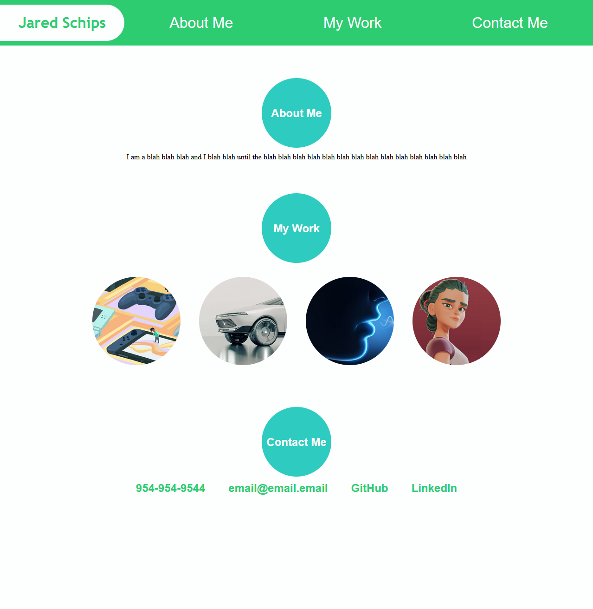

# My Portfolio

## Description

This is a portfolio website which will be used to exhibit my completed projects. By consolidating all of my projects in one location, this website aims to serve as a useful demonstration of my skillset for anybody who is interested in evaluating my capabilities as a programmer.

## Usage

You can access the website at [this link](https://jaredschips.github.io/bootcamp-week-2-challenge/)

It should look something like this:

## License

No License